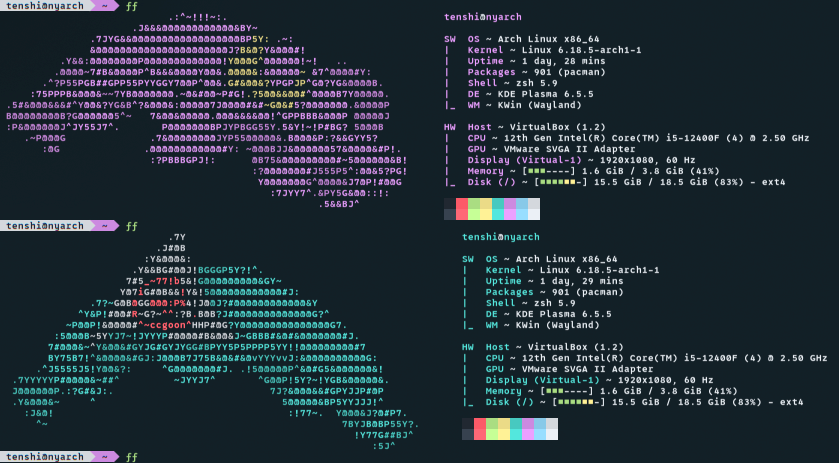
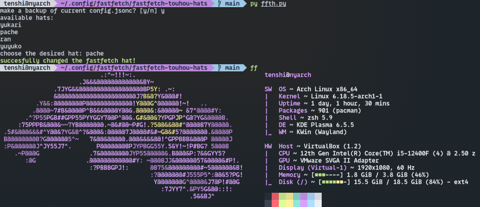

# fastfetch-touhou-hats
A simple Python srcipt that applies Touhou characters' hats as fastfetch logo



# Installation


```
cd ~/.config/fastfetch

git clone https://github.com/pwoertnehsi/fastfetch-touhou-hats
```

Note: fastfetch doesn't make a directory in ~/.config when you install it, so you might need to create one.

Then, cd into the cloned repo and run bin/ffth. Additionally, you can add this binary to your PATH via running this command so that you can change the hat at any moment.

```
export PATH=$PATH:~/.config/fastfetch/fastfetch-touhou-hats/bin
```

# Usage



Beware that config.jsonc.bak is overriden if it already exists and you've chosen to backup!

# Character List

These are the characters whose hats are available. Links are the arts that I've traced the hats from. 

- [Patchouli Knowledge](https://gelbooru.com/index.php?page=post&s=view&id=3442232)
- [Saigyouji Yuyuko](https://www.pixiv.net/en/artworks/138944424)
- [Yakumo Yukari](https://girlcockx.com/y_karas/status/1110231080613740544)
- [Yakumo Ran](https://girlcockx.com/miyama_sos/status/1997801267197088189)

# TODO

- Kurokoma Saki
- Moriya Suwako
- Futatsuiwa Mamizou
- Hong Meiling
- Hakurei Reimu
- Kirisame Marisa
